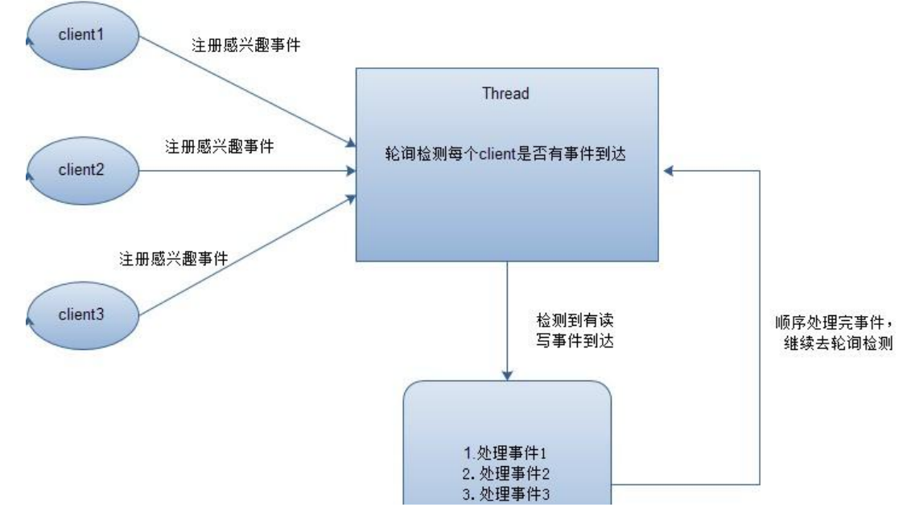
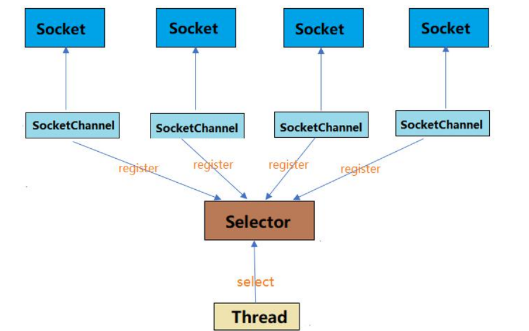
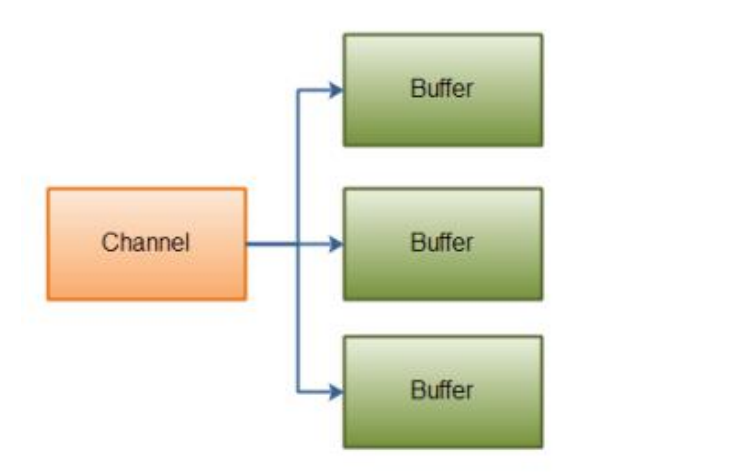
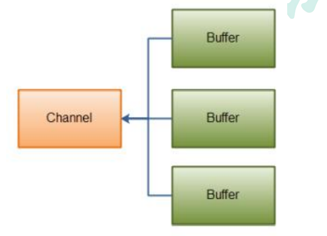
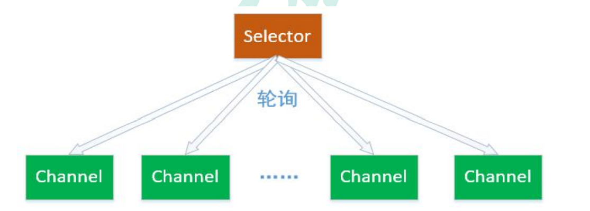
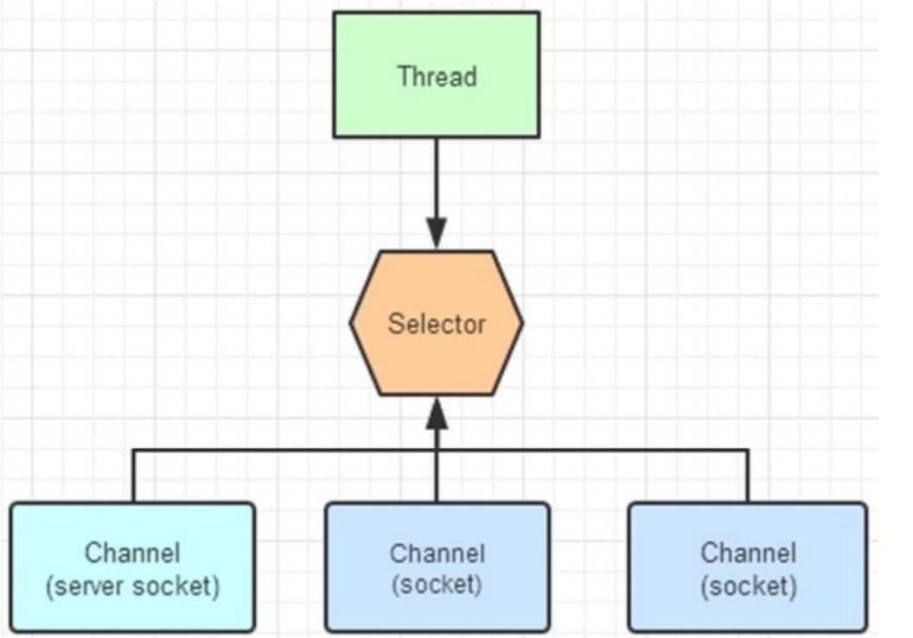
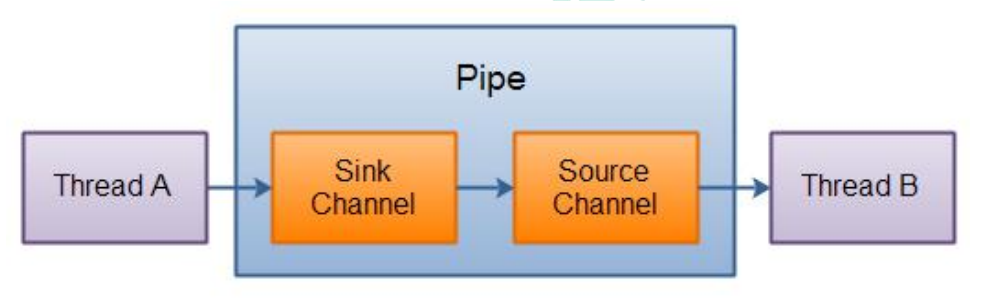

# java NIO

## IO简介

IO的操作方式：

1. 同步阻塞BIO
2. 同步非阻塞NIO
3. 异步非阻塞AIO

Java NIO（New IO 或 Non Blocking IO）是从 Java 1.4 版本开始引入的一个新的 IO API，可以替代标准的 Java IO API。**NIO 支持面向缓冲区的、基于通道的 IO 操作。** **NIO 将以更加高效的方式进行文件的读写操作。**BIO 与 NIO 一个比较重要的不同是， 我们使用 BIO 的时候往往会引入多线程，每个连接对应一个单独的线程；而 **NIO 则是 使用单线程或者只使用少量的多线程，让连接共用一个线程。**

AIO 也就是 NIO 2，在 Java 7 中引入了 NIO 的改进版 NIO 2,它是异步非阻塞的 IO 模型。

### 阻塞IO（BIO）

阻塞 IO（BIO）是最传统的一种 IO 模型，即在读写数据过程中会发生阻塞现象，直至 有可供读取的数据或者数据能够写入。

在 BIO 模式中，服务器会为每个客户端请求建立一个线程，由该线程单独负责 处理一个客户请求，这种模式虽然简单方便，但由于服务器为每个客户端的连接都采 用一个线程去处理，使得**资源占用非常大**。因此，当连接数量达到上限时，如果再有 用户请求连接，直接会导致资源瓶颈，严重的可能会直接导致服务器崩溃。

大多数情况下为了避免上述问题，都采用了线程池模型。也就是创建一个固定大 小的线程池，如果有客户端请求，就从线程池中取一个空闲线程来处理，当客户端处 理完操作之后，就会释放对线程的占用。因此这样就避免为每一个客户端都要创建线 程带来的资源浪费，使得线程可以重用。但线程池也有它的弊端，如果连接大多是长 连接，可能会导致在一段时间内，线程池中的线程都被占用，那么当再有客户端请求 连接时，由于没有空闲线程来处理，就会导致客户端连接失败。

### 非阻塞IO(NIO)

NIO 采用非阻塞模式，基于 Reactor 模式的工作方式，I/O 调用不会被阻塞，它 的实现过程是：会先对每个客户端注册感兴趣的事件，然后有一个线程专门去轮询每 个客户端是否有事件发生，当有事件发生时，便顺序处理每个事件，当所有事件处理 完之后，便再转去继续轮询。



NIO 中实现非阻塞 I/O 的核心对象就是 Selector，Selector 就是注册各种 I/O 事件地方，而且当我们感兴趣的事件发生时，就是这个对象告诉我们所发生的事件



NIO 的最重要的地方是当一个连接创建后，不需要对应一个线程，这个连接会被 注册到多路复用器上面，一个选择器线程可以同时处理成千上万个连接，系统不必创 建大量的线程，也不必维护这些线程，从而大大减小了系统的开销。

### 异步非阻塞IO(AIO)

AIO 也就是 NIO 2，在 Java 7 中引入了 NIO 的改进版 NIO 2,它是异步非阻塞 的 IO 模型。异步 IO 是基于事件和回调机制实现的，也就是说 AIO 模式不需要selector 操作，而是是事件驱动形式，也就是当客户端发送数据之后，会主动通知服 务器，接着服务器再进行读写操作。

Java 的 AIO API 其实就是 Proactor 模式的应用，和 Reactor 模式类似。 Reactor 和 Proactor 模式的主要区别就是真正的读取和写入操作是有谁来完成的， Reactor 中需要应用程序自己读取或者写入数据，而 Proactor 模式中，应用程序不需 要进行实际的读写过程，它只需要从缓存区读取或者写入即可，操作系统会读取缓存 区或者写入缓存区到真正的 IO 设备。

## NIO概述

Java NIO由以下集合核心部分组成：

1. Channels
2. Buffers
3. Selectors

## Channel

Channel 和 IO 中的 Stream(流)是差不 多一个等级的。只不过 Stream 是单向的，而 Channel 是双向的，既可以用来进行读操作，又可以用来进行写操作。

Channel的特点：

1. 既可以从Channel中读取数据，又可以写数据到Channel
2. Channel可以异步地读写
3. 通道中的数据总是要先读到一个 Buffer，或者总是要从一个 Buffer 中写

Channel地实现类：FileChannel、DatagramChannel、SocketChannel、ServerSocketChannel

### FileChannel

FileChannel 从文件中读写数据。

在使用 FileChannel 之前，必须先打开它。但是，我们无法直接打开一个 FileChannel，需要通过使用一个 InputStream、OutputStream 或 RandomAccessFile 来获取一个 FileChannel 实例

调用多个 read()方法之一从 FileChannel 中读取数据。首先，分配一个 Buffer。从 FileChannel 中读取的数据将被读到 Buffer 中。然后，调 用 FileChannel.read()方法。该方法将数据从 FileChannel 读取到 Buffer 中。read() 方法返回的 int 值表示了有多少字节被读到了 Buffer 中。如果返回-1，表示到了文件 末尾。

使用 FileChannel.write()方法向 FileChannel 写数据，该方法的参数是一个 Buffer。

关闭Channel

操作：

[FileChannel](./channel/FileChannelTest.java)

### Socket  Channel

SocketChannel 就是 NIO 对于非阻塞 socket 操作的支持的组件，其在 socket 上 封装了一层，主要是支持了非阻塞的读写。同时改进了传统的单向流 API,，Channel 同时支持读写。

socket 通道类主要分为 DatagramChannel、SocketChannel 和 ServerSocketChannel，它们在被实例化时都会创建一个对等 socket 对象。要把一个 socket 通道置于非阻塞模式，我们要依靠所有 socket 通道类的公有超级类： SelectableChannel。就绪选择（readiness selection）是一种可以用来查询通道的 机制，该查询可以判断通道是否准备好执行一个目标操作，如读或写。非阻塞 I/O 和 可选择性是紧密相连的，那也正是管理阻塞模式的 API 代码要在 SelectableChannel 超级类中定义的原因。

设置或重新设置一个通道的阻塞模式是很简单的，只要调用 configureBlocking( )方法即可，传递参数值为 true 则设为阻塞模式，参数值为 false 值设为非阻塞模式。可以通过调用 isBlocking( )方法来判断某个 socket 通道当前处于 哪种模式。

#### ServerSocketChannel

ServerSocketChannel 可以监听新进来的 TCP 连接，像 Web 服务器那样。对 每一个新进来的连接都会创建一个 SocketChannel。


#### SocketChannel

SocketChannel 能通过 TCP 读写网络中的数据。

**SocketChannel特征**

1. 对于已经存在的 socket 不能创建 SocketChannel

2. SocketChannel 中提供的 open 接口创建的 Channel 并没有进行网络级联，需要使 用 connect 接口连接到指定地址

3. 未进行连接的 SocketChannle 执行 I/O 操作时，会抛出 NotYetConnectedException

4. SocketChannel 支持两种 I/O 模式：阻塞式和非阻塞。

5. SocketChannel 支持异步关闭。

6. SocketChannel 支持设定参数

    1. SO_SNDBUF 套接字发送缓冲区大小
    2. SO_RCVBUF 套接字接收缓冲区大小
    3. SO_KEEPALIVE 保活连接
    4. O_REUSEADDR 复用地址
    5. SO_LINGER 有数据传输时延缓关闭 Channel (只有在非阻塞模式下有用)
    6. TCP_NODELAY 禁用 Nagle 算法
    


#### DatagramChannel

DatagramChannel 能通过 UDP 读写网络中的数据。

####操作
[Socket-Channel](./channel/SocketChannelTest.java)


### Scatter/Gather

Java NIO 开始支持 scatter/gather，scatter/gather 用于描述从 Channel 中读取或 者写入到 Channel 的操作。

分散（scatter）从 Channel 中读取是指在读操作时将读取的数据写入多个 buffer 中。 因此，Channel 将从 Channel 中读取的数据“分散（scatter）”到多个 Buffer 中。

聚集（gather）写入 Channel 是指在写操作时将多个 buffer 的数据写入同一个 Channel，因此，Channel 将多个 Buffer 中的数据“聚集（gather）”后发送到 Channel。

**Scattering Reads** 是指数据从一个 channel 读取到多个 buffer 中。



```java
ByteBuffer header = ByteBuffer.allocate(128);
ByteBuffer body = ByteBuffer.allocate(1024);
ByteBuffer[] bufferArray = { header, body };
channel.read(bufferArray);
```

read()方法按照 buffer 在数组中的顺序将从 channel 中读取的数据写入到 buffer，当 一个 buffer 被写满后，channel 紧接着向另一个 buffer 中写

Scattering Reads 在移动下一个 buffer 前，必须填满当前的 buffer，这也意味着它 不适用于动态消息

**Gathering Writes** 是指数据从多个 buffer 写入到同一个 channel。



```java
ByteBuffer header = ByteBuffer.allocate(128);
ByteBuffer body = ByteBuffer.allocate(1024);
ByteBuffer[] bufferArray = { header, body };
channel.write(bufferArray);
```

buffers 数组是 write()方法的入参，write()方法会按照 buffer 在数组中的顺序，将数 据写入到 channel，注意只有 position 和 limit 之间的数据才会被写入。因此，如果 一个 buffer 的容量为 128byte，但是仅仅包含 58byte 的数据，那么这 58byte 的数 据将被写入到 channel 中。因此与 Scattering Reads 相反，Gathering Writes 能较 好的处理动态消息。

## Buffer

Java NIO 中的 Buffer 用于和 NIO 通道进行交互。数据是从通道读入缓冲区，从缓冲 区写入到通道中的。

缓冲区本质上是一块可以写入数据，然后可以从中读取数据的内存。这块内存被包装 成 NIO Buffer 对象，并提供了一组方法，用来方便的访问该块内存。缓冲区实际上是 一个容器对象，更直接的说，其实就是一个数组，在 NIO 库中，所有数据都是用缓冲 区处理的。在读取数据时，它是直接读到缓冲区中的； 在写入数据时，它也是写入到 缓冲区中的；任何时候访问 NIO 中的数据，都是将它放到缓冲区中。

### Buffer的基本用法

使用 Buffer 读写数据，一般遵循以下四个步骤：

1. 写入数据到 Buffer
2. 调用 flip()方法 转换模式
3. 从 Buffer 中读取数据
4. 调用 clear()方法或者 compact()方法 清空缓冲区

当向 buffer 写入数据时，buffer 会记录下写了多少数据。一旦要读取数据，需要通过 flip()方法将 Buffer 从写模式切换到读模式。在读模式下，可以读取之前写入到 buffer 的所有数据。一旦读完了所有的数据，就需要清空缓冲区，让它可以再次被写入。有 两种方式能清空缓冲区：调用 clear()或 compact()方法。clear()方法会清空整个缓冲 区。compact()方法只会清除已经读过的数据。任何未读的数据都被移到缓冲区的起 始处，新写入的数据将放到缓冲区未读数据的后面。

### Buffer 的 capacity、position 和 limit

Buffer的三个属性：

1. apacity
2. position
3. limit

position 和 limit 的含义取决于 Buffer 处在读模式还是写模式。不管 Buffer 处在什么 模式，capacity 的含义总是一样的。

#### capacity

作为一个内存块，Buffer 有一个固定的大小值，也叫“capacity”.你只能往里写 capacity 个 byte、long，char 等类型。一旦 Buffer 满了，需要将其清空（通过读数 据或者清除数据）才能继续写数据往里写数据。

也就是说capacity是Buffer缓冲区的大小

#### position

position就是一个读写操作的指针，指向读写操作的buffer单元

**写数据**到 Buffer 中时，position 表示写入数据的当前位置，position 的初始值为 0。当一个 byte、long 等数据写到 Buffer 后， position 会向下移动到下一个可插入 数据的 Buffer 单元。position 最大可为 capacity – 1（因为 position 的初始值为0）

**读数据**到 Buffer 中时，position 表示读入数据的当前位置。通过 ByteBuffer.flip()切换到 读模式时 position 会被重置为 0，当 Buffer 从 position 读入数据后，position 会下 移到下一个可读入的数据 Buffer 单元

#### limit

limit就是读写操作时最大位置的指针，position的上限

**写数据**时，limit 表示可对 Buffer 最多写入多少个数据。写模式下，limit 等于 Buffer 的 capacity

**读数据**时，limit 表示 Buffer 里有多少可读数据（not null 的数据），因此能读到 之前写入的所有数据（limit 被设置成已写数据的数量，这个值在写模式下就是 position）。

### Buffer中的方法

rewind() 将 position 设回 0，limit 保 持不变。

clear()与compact()  调用的是 clear()方法，position 将被设回 0，limit 被设置成 capacity 的值。

如果 Buffer 中有一些未读的数据，调用 clear()方法，数据将“被遗忘”，意味着不再 有任何标记会告诉你哪些数据被读过，哪些还没有。

compact()方法将所有未读的数据拷贝到 Buffer 起始处。然后将 position 设到最后一 个未读元素正后面。limit 属性依然像 clear()方法一样，设置成 capacity 的值

### 缓冲区

#### 缓冲区分片

在 NIO 中，除了可以分配或者包装一个缓冲区对象外，还可以根据现有的缓冲区对象 来创建一个子缓冲区，即在现有缓冲区上切出一片来作为一个新的缓冲区，但现有的 缓冲区与创建的子缓冲区在底层数组层面上是数据共享的

调用 slice()方法可以创建一个子缓冲区。

#### 只读缓冲区

只读缓冲区非常简单，可以读取它们，但是不能向它们写入数据。可以通过调用缓冲 区的 asReadOnlyBuffer()方法，将任何常规缓冲区转 换为只读缓冲区，这个方法返回 一个与原缓冲区完全相同的缓冲区，并与原缓冲区共享数据，只不过它是只读的。

如果尝试修改只读缓冲区的内容，则会报 ReadOnlyBufferException 异常。只读缓冲 区对于保护数据很有用。

#### 直接缓冲区

直接缓冲区是为加快 I/O 速度，使用一种特殊方式为其分配内存的缓冲区，JDK 文档 中的描述为：给定一个直接字节缓冲区，Java 虚拟机将尽最大努力直接对它执行本机 I/O 操作。也就是说，它会在每一次调用底层操作系统的本机 I/O 操作之前(或之后)， 尝试避免将缓冲区的内容拷贝到一个中间缓冲区中 或者从一个中间缓冲区中拷贝数据。 要分配直接缓冲区，需要调用 allocateDirect()方法，而不是 allocate()方法，使用方 式与普通缓冲区并无区别

#### 内存映射文件 I/O

## Selector

Selector 一般称 为选择器 ，也可以翻译为 多路复用器 。它是 Java NIO 核心组件中 的一个，用于检查一个或多个 NIO Channel（通道）的状态是否处于可读、可写。可以实现单线程管理多个 channel，也就是可以管理多个网络连接



使用 Selector 的好处在于： 使用更少的线程来就可以来处理通道了， 相比使用多个 线程，避免了线程上下文切换带来的开销。

### 可选择通道

不是所有的 Channel 都可以被 Selector 复用的。比方说，FileChannel 就不能 被选择器复用。判断一个 Channel 能被 Selector 复用，有一个前提：判断他是否继 承了一个抽象类 SelectableChannel。如果继承了 SelectableChannel，则可以被复 用，否则不能。

SelectableChannel 类提供了实现通道的可选择性所需要的公共方法。它是所有 支持就绪检查的通道类的父类。

一个通道可以被注册到多个选择器上，但对每个选择器而言只能被注册一次。通 道和选择器之间的关系，使用注册的方式完成。SelectableChannel 可以被注册到 Selector 对象上，在注册的时候，需要指定通道的哪些操作，是 Selector 感兴趣的。



### Channel 注册到 Selector

使用 Channel.register（Selector sel，int ops）方法，将一个通道注册到一个 选择器时。第一个参数，指定通道要注册的选择器。第二个参数指定选择器需要查询 的通道操作。

可以供选择器查询的通道操作，从类型来分，包括以下四种：

1. 可读 : SelectionKey.OP_READ
2. 可写 : SelectionKey.OP_WRIT
3. 连接 : SelectionKey.OP_CONNECT
4. 接收 : SelectionKey.OP_ACCEPT

如果 Selector 对通道的多操作类型感兴趣，可以用“位或”操作符(|)来实现

选择器查询的不是通道的操作，而是通道的某个操作的一种就绪状态。什么是操 作的就绪状态？一旦通道具备完成某个操作的条件，表示该通道的某个操作已经就绪， 就可以被 Selector 查询到，程序可以对通道进行对应的操作。

### 选择键

Channel 注册到后，并且一旦通道处于某种就绪的状态，就可以被选择器查询到。 这个工作，使用选择器 Selector 的 select（）方法完成。select 方法的作用，对感兴 趣的通道操作，进行就绪状态的查询。

Selector 可以不断的查询 Channel 中发生的操作的就绪状态。并且挑选感兴趣 的操作就绪状态。一旦通道有操作的就绪状态达成，并且是 Selector 感兴趣的操作， 就会被 Selector 选中，放入选择键集合中。

一个选择键，首先是包含了注册在 Selector 的通道操作的类型，比方说 SelectionKey.OP_READ。也包含了特定的通道与特定的选择器之间的注册关系。

选择键的概念，和事件的概念比较相似。一个选择键类似监听器模式里边的一个 事件。由于 Selector 不是事件触发的模式，而是主动去查询的模式，所以不叫事件 Event，而是叫 SelectionKey 选择键。

### Selector的使用

#### 创建

```java
Selector selector = Selector.open()
```

#### 注册

```java
// 1、获取 Selector 选择器
Selector selector = Selector.open();
// 2、获取通道
ServerSocketChannel serverSocketChannel = ServerSocketChannel.open();
// 3.设置为非阻塞
serverSocketChannel.configureBlocking(false);
// 4、绑定连接
serverSocketChannel.bind(new InetSocketAddress(9999));
// 5、将通道注册到选择器上,并制定监听事件为：“接收”事件
serverSocketChannel.register(selector,SelectionKey.OP_ACCEPT);
```

与 Selector 一起使用时，Channel 必须处于非阻塞模式下，否则将抛出异常 IllegalBlockingModeException。

#### 轮询查询就绪操作

通过 Selector 的 select（）方法，可以查询出已经就绪的通道操作，这些就绪的 状态集合，包存在一个元素是 SelectionKey 对象的 Set 集合中。

下面是 Selector 几个重载的查询 select()方法：

- select():阻塞到至少有一个通道在你注册的事件上就绪了。
- select(long timeout)：和 select()一样，但最长阻塞事件为 timeout 毫秒。
- selectNow():非阻塞，只要有通道就绪就立刻返回。

select()方法返回的 int 值，表示有多少通道已经就绪，更准确的说，是自前一次 select 方法以来到这一次 select 方法之间的时间段上，有多少通道变成就绪状态。

一旦调用 select()方法，并且返回值不为 0 时，在 Selector 中有一个 selectedKeys()方 法，用来访问已选择键集合，迭代集合的每一个选择键元素，根据就绪操作的类型， 完成对应的操作

```java
Set selectedKeys = selector.selectedKeys();
Iterator keyIterator = selectedKeys.iterator();
while(keyIterator.hasNext()) {
SelectionKey key = keyIterator.next();
while(keyIterator.hasNext()){
    if(key.isAcceptable()) {
		// a connection was accepted by a ServerSocketChannel. 
	} else if (key.isConnectable()) {
		// a connection was established with a remote server. 
	} else if (key.isReadable()) {
		// a channel is ready for reading
	} else if (key.isWritable()) {
		// a channel is ready for writing
	}
	keyIterator.remove();
}
```

#### 停止选择的方法

选择器执行选择的过程，系统底层会依次询问每个通道是否已经就绪，这个过程可能 会造成调用线程进入阻塞状态,那么我们有以下三种方式可以唤醒在 select（）方法中 阻塞的线程。

wakeup()方法 ：通过调用 Selector 对象的 wakeup（）方法让处在阻塞状态的 select()方法立刻返回。该方法使得选择器上的第一个还没有返回的选择操作立即返回。如果当前没有进行中 的选择操作，那么下一次对 select()方法的一次调用将立即返回。

close()方法 ：通过 close（）方法关闭 Selector， 该方法使得任何一个在选择操作中阻塞的线程都被唤醒（类似 wakeup（）），同时 使得注册到该 Selector 的所有 Channel 被注销，所有的键将被取消，但是 Channel 本身并不会关闭。

#### 操作
[SelectorDemo01](./selector/SelectorDemo01.java)

[SelectorDemo02](./selector/SelectorDemo02.java)
### Pipe

Pipe即管道。在操作系统进程中学过进程通信的方式，其中之一就是管道

Java NIO 管道是 2 个线程之间的单向数据连接。Pipe 有一个 source 通道和一个 sink 通道。数据会被写到 sink 通道，从 source 通道读取。



操作：
[PipeTest](./Pipe/PipeTest.java)

### FileLock

文件锁在 OS 中很常见，如果多个程序同时访问、修改同一个文件，很容易因为文件 数据不同步而出现问题。给文件加一个锁，同一时间，只能有一个程序修改此文件， 或者程序都只能读此文件，这就解决了同步问题。

文件锁是进程级别的，不是线程级别的。文件锁可以解决多个进程并发访问、修改同 一个文件的问题，但不能解决多线程并发访问、修改同一文件的问题。使用文件锁时， 同一进程内的多个线程，可以同时访问、修改此文件。

文件锁是当前程序所属的 JVM 实例持有的，一旦获取到文件锁（对文件加锁），要调 用 release()，或者关闭对应的 FileChannel 对象，或者当前 JVM 退出，才会释放这 个锁。

一旦某个进程（比如说 JVM 实例）对某个文件加锁，则在释放这个锁之前，此进程不 能再对此文件加锁，就是说 JVM 实例在同一文件上的文件锁是不重叠的（进程级别不 能重复在同一文件上获取锁）。

文件锁的分类：

排它锁：又叫独占锁。对文件加排它锁后，该进程可以对此文件进行读写，该进程独 占此文件，其他进程不能读写此文件，直到该进程释放文件锁。

共享锁：某个进程对文件加共享锁，其他进程也可以访问此文件，但这些进程都只能 读此文件，不能写。线程是安全的。只要还有一个进程持有共享锁，此文件就只能读， 不能写。

获取文件锁：

1. lock() 对整个文件加锁，默认为排它锁。
2. ock(long position, long size, booean shared) //自定义加锁方式。前 2 个参数 指定要加锁的部分（可以只对此文件的部分内容加锁），第三个参数值指定是否是共 享锁。
3. tryLock() 对整个文件加锁，默认为排它锁。
4. tryLock(long position, long size, booean shared) //自定义加锁方式。 如果指定为共享锁，则其它进程可读此文件，所有进程均不能写此文件，如果某进程 试图对此文件进行写操作，会抛出异常

lock与tryLock的区别：

lock 是阻塞式的，如果未获取到文件锁，会一直阻塞当前线程，直到获取文件锁

tryLock 和 lock 的作用相同，只不过 tryLock 是非阻塞式的，tryLock 是尝试获取文 件锁，获取成功就返回锁对象，否则返回 null，不会阻塞当前线程。

操作：
[FileLockDemo](./FileLock/FileLockDemo.java)    

